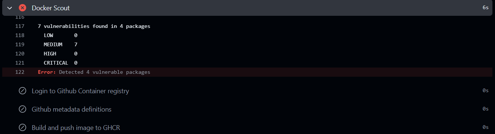

# Programowanie Aplikacji w Chmurze Obliczeniowej - Zadanie 2
### Maciej Przyłucki

Łańcuch CI został uzupełniony o następujące kroki:
- Wykonanie testu CVE
- Zalogowanie do GHCR
- Zdefiniowanie metadanych potrzebnych do przesłania obrazu do repozytorium
- Zbudowanie i przesłanie obrazu do repozytorium

Sprawdzenie obecności podatności na zagrożenia odbywa się w kroku o id <i>docker-scout</i>:

```
name: Docker Scout
id: docker-scout
uses: docker/scout-action@v1
with:
    command: cves
    image: ${{ steps.meta.outputs.tags }}
    only-severities: critical,high
    exit-code: true
```

<div style="text-align: justify">Opcja <i>only-severities</i> określa poziom zagrożeń, które mają być sprawdzane, natomiast <i>exit-code</i> pozwala na zatrzymanie workflow - w przypadku znalezienia jakichkolwiek podatności na zagrożenia zostanie zwrócony kod "2" i krok zakończy się niepowodzeniem. Używany obraz posiada 7 podatności na poziomie <i>medium</i>, więc w celu sprawdzenia poprawności działania łańcucha, workflow został uruchomiony z pominięciem opcji <i>only-severities</i>.</div> <br />

 <br />

<div style="text-align: justify">Powyższy zrzut ekranu obrazuje wynik uruchomienia workflow w wyżej opisanej konfiguracji. Komunikat o błędzie zwraca liczbę pakietów podatnych na zagrożenia. Następne kroki odpowiadające za umieszczenie obrazu w GHCR nie zostają podjęte.</div>
